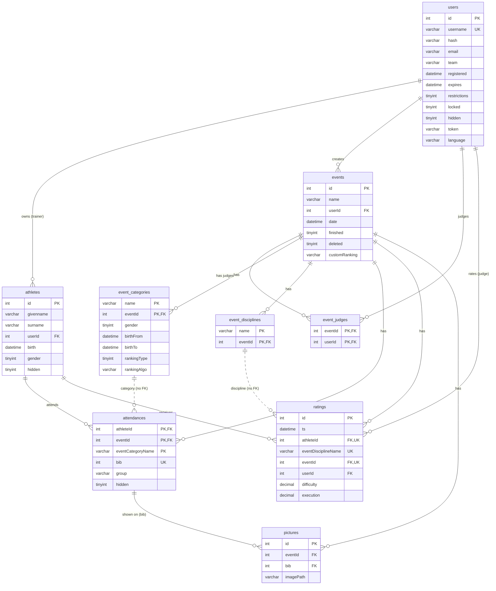

# Jurysystem
## Datenstruktur

```mermaid
erDiagram
    users {
        int id PK
        varchar username UK
        varchar hash
        varchar email
        varchar team
        datetime registered
        datetime expires
        tinyint restrictions
        tinyint locked
        tinyint hidden
        varchar token
        varchar language
    }

    athletes {
        int id PK
        varchar givenname
        varchar surname
        int userId FK
        datetime birth
        tinyint gender
        tinyint hidden
    }

    events {
        int id PK
        varchar name
        int userId FK
        datetime date
        tinyint finished
        tinyint deleted
        varchar customRanking
    }

    event_judges {
        int eventId PK, FK
        int userId PK, FK
    }

    event_categories {
        varchar name PK
        int eventId PK, FK
        tinyint gender
        datetime birthFrom
        datetime birthTo
        tinyint rankingType
        varchar rankingAlgo
    }

    event_disciplines {
        varchar name PK
        int eventId PK, FK
    }

    attendances {
        int athleteId PK, FK
        int eventId PK, FK
        varchar eventCategoryName PK
        int bib UK
        varchar group
        tinyint hidden
    }

    ratings {
        int id PK
        datetime ts
        int athleteId FK, UK
        varchar eventDisciplineName UK
        int eventId FK, UK
        int userId FK
        decimal difficulty
        decimal execution
    }

    pictures {
        int id PK
        int eventId FK
        int bib FK
        varchar imagePath
    }

    users ||--o{ athletes : "owns (trainer)"
    users ||--o{ events : "creates"
    users ||--o{ event_judges : "judges"
    events ||--o{ event_judges : "has judges"
    events ||--o{ event_categories : "has"
    events ||--o{ event_disciplines : "has"
    events ||--o{ attendances : "has"
    athletes ||--o{ attendances : "attends"
    event_categories ||..o{ attendances : "category (no FK)"
    events ||--o{ ratings : "has"
    athletes ||--o{ ratings : "receives"
    users ||--o{ ratings : "rates (judge)"
    event_disciplines ||..o{ ratings : "discipline (no FK)"
    events ||--o{ pictures : "has"
    attendances ||--o{ pictures : "shown on (bib)"
```
